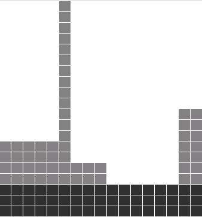

This is the puzzle **Big City Skyline** from the Google Code Jam
`practice page <http://static.googleusercontent.com/media/services.google.com/en//blog_resources/Google_CodeJam_Practice.pdf>`_.

The files:

::

    small.in

is the data shown in the problem definition.

::

    Google_CodeJam_Practice.pdf

is the original Google statement of the problem.

::

    big_city_skyline.py

is, hopefully, a solution to the problem.

The test input data files:

::

    test?.in

are used to test the program(s).  They are small hand-generated test cases.

The problem, from the web page
==============================

You've just moved to the Big City so you could start work at the newest Google
office, Google BC, and the one thing that interests you most is the beautiful
skyline. You're sitting on a hillside ten miles away, looking at the big
rectangular buildings that make up the city, and you think back to your
childhood.

When you were a child, you used to make toy cities out of rectangular blocks.
Each building could be made from multiple blocks, and each block could be part
of multiple buildings. Looking at the skyline, you wonder: what is the biggest
possible block that could be part of the Big City's skyline?

Write a program that takes the description of the skyline as an input, and gives
the area of the maximum-area rectangle as output. This program should take less
than 4 minutes to run on a 2GHz computer with 512MB of RAM, even for the biggest
input size we specify.

Input:

The city is made out of rectangular buildings, all next to each other. The input will consist of an integer N,
the number of buildings, followed by a series of N number pairs w i h i , indicating the width and height of each
building in order from left to right. The buildings' heights will be less than 100,000,000, and their widths will
be less than 1000.
Easy: 0 < N < 1,000
Hard: 0 < N < 10,000,000
Output:
A single number: the area of the largest possible block. (Here's the beautiful skyline of the Big City.)

+-----------------------+-----------------------+-----------------------------------+
| Sample Input          | Sample Output         |Explanation                        |
+=======================+=======================+===================================+
| 5                     | 51                    | The biggest block is shaded black |
| 5 7 1 20 3 5 6 3 2 10 |                       | in the figure above.              |
+-----------------------+-----------------------+-----------------------------------+
