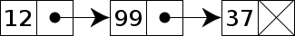

Single-Linked List
==================

This tutorial designs and tests python code that iplements a *singly-linked
list* data structure (SLL).  An SLL is usually drawn like this in the typical
'box and arrow' form:

This example shows a list that is referred to by a variable *my_list*.  The
first element of the list consists of two parts: the value ('A' in this case)
and a reference to the *next* element in the list.  This continues to the right
until the last element which contains a 'null' reference which is just a special
value that cannot be a pointer or reference to another element.  In python we
use the *None* value.  When drawing this special reference on a whiteboard or
in a picture we often use the electical earth symbol, but sometimes you may see
it drawn like this:

.. image:: end_of_list.png
    :alt: An alternate way of drawing the 'null' reference

Implementation
==============

So, how are we going to do this in python?

One obvious way is to define a class *SSL* that contains a *value* and *next*
reference:

::

    class SSL(object):
        def __init__(self, value, next=None):
            self.value = value
            self.next = next

And we would create the linked list above in this way:

::

    my_list = SSL('A',
                  SSL(20,
                      SSL('q',
                          SSL('M'))))

We could have done it this way, which may be easier to read:

::

    my_list = SSL('M')
    my_list = SSL('q', my_list)
    my_list = SSL(20, my_list)
    my_list = SSL('A', my_list)

