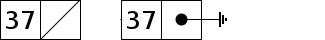

Single-Linked List
==================

This tutorial designs and tests python code that implements a *singly-linked
list* data structure (SLL).  An SLL is a special case of a generalized
`Linked List <https://en.wikipedia.org/wiki/Linked_list>`_.

Of course, we *could* implenent an SLL simply as a python list, but that
defeats the purpose of this tutorial, which is to show one or more ways to
actually implement a singly-linked list.  Doing this shows the student just
*why* some list operations are expensive and why some are cheap.

An SLL is usually drawn like this in the typical 'box and arrow' form:

.. image:: sll.png
    :alt: A singly-linked list

We keep a reference to the first element of the list in some variable.  The
first element of the list consists of two parts: the value (12 in this case)
and a reference to the *next* element in the list.  This continues to the right
until the last element which contains a 'null' *next* reference which is just a
special value that cannot be a reference to another element.  In
python we use the *None* value.  When drawing this special reference on a
whiteboard or in a picture we often just draw a large 'X' as shown above.
Sometimes you might see only one line of the 'X' or even he electrical
'earth' symbol:

SLL Operations
==============

Once we have an SLL there are many things we might do with it:

* get the length of the list
* add a new element at the front
* add a new element at the end
* find an element in the list
* add a new element after a found element
* remove an element in the list
* remove the first element in the list
* remove the last element in the list
* do something with each value in order

Implementation
==============

So, how are we going to do this in python?  Here are a few ways.

Use a class as a list element
-----------------------------

One obvious way is to define a class *SLL* that contains a *value* and *next*
reference:

::

    class SLL(object):
        def __init__(self, value, next=None):
            self.value = value
            self.next = next

And we would create the example linked list above in this way:

::

    my_list = SLL(12, SLL(99, SLL(37))))

Or we could have done it this way, which may (or may not) be easier to read:

::

    my_list = SLL(12)
    my_list = SLL(99, my_list)
    my_list = SLL(37, my_list)

Use a tuple as a list element
-----------------------------

Another way would be to just use a 2-tuple:

::

    my_list = (37, None)
    my_list = (99, my_list)
    my_list = (12, my_list)

Following on from the SLL approach above, we could have written this as:

::

    my_list = (12, (99, (37, None)))

which is shorter and brings some joy to the hearts of old Lisp programmers!

Of course, tuples are *immutable*, so we have some trouble changing an SSL.
We actually implement the 'tuple' code with two element *lists*.

Define a List class
-------------------

We could also go full
`OOP <https://en.wikipedia.org/wiki/Object-oriented_programming>`_
and define an SLL class that has lots of state and methods.  Everything is
hidden away in the class:

::

    class SLL(object):
    
        class elem(object(object)):
            def __init__(self, value, next=None):
                self.value = value
                self.next = next
    
        def __init__(self):
            # some sort of initialization
            self.sll = None
    
        def add_at front(self, value):
            self.sll = elem(value, self.sll)
    
        # etc
    
    my_list = SLL()
    my_list.add_at_end(12)
    my_list.add_at_end(99)
    my_list.add_at_end(37)

There are many other ways of implementing an SLL.  We will only examine the
three above.

All the *element* code is in the file **sll_element.py**.  The *tuple* code
is in **sll_tuple.py**, and the *class* code is in **sll_class.py**.

Element Implementation
======================

We now write the python code to implement the *element* approach.  All this
code is in the **sll_element.py** file.  We will put the test code into
**test_sll_element.py**.  Later, **test_sll.py** will test all three
implementations.

len = length(sll)
-----------------

The *length()* function is quite simple and straightforward:

::

    def length(sll):
        """Return the count of elements in 'sll'."""
     
        count = 0
     
        while sll is not None:
            count += 1
            sll = sll.next
     
        return count

Of course, after we implement each function we write test cases in
**test_sll.py**.  For the *length()* function we have:

::

    def test_length(self):
        """Check that length() works."""
    
        my_sll = sll.SLL('M')
        my_sll = sll.SLL('q', my_sll)
        my_sll = sll.SLL(20, my_sll)
        my_sll = sll.SLL('A', my_sll)
        expected_len = 4
    
        self.assertEqual(sll.length(my_sll), expected_len)
    
    def test_length2(self):
        """Check that len() works on an empty list."""
    
        my_sll = None
        expected_len = 0
    
        self.assertEqual(sll.length(my_sll), expected_len)
    
    def test_length3(self):
        """Check that length() works."""
    
        my_sll = sll.SLL('M')
        expected_len = 1
    
        self.assertEqual(sll.length(my_sll), expected_len)

We won't show any further testing code until we implement the *tuple*
approach unless there is some interesting point.

sll = add_front(sll, value)
---------------------------

This function adds a new element containing *value* at the front of an SLL.
The implementation code shows us how simple this is:

::

    def add_front(sll, value):
        """Add a new element containing 'value' at the front of an SLL.
     
        Returns a reference to the new head of the SLL.
        """
    
        new_sll = SLL(value, sll)
        return new_sll

sll = add_end(sll, value)
-------------------------

This function looks to be as easy to implement as the *add_front()* function,
but here we see the complications that arise even in a simple SLL:

::

    def add_end(sll, value):
        """Add a new element containing 'value' at the end of an SLL.
    
        Returns a reference to the head of the SLL.
        Just to be the same as add_front().
        """
    
        # find last element of the SLL
        last = _find_last(sll)
        if last is None:
            # SLL is empty
            return SLL(value)
    
        # add new element to end
        last.next = SLL(value)
        return sll

We must handle the special case of an empty SLL.

Note that we use a special helper function here: *_find_last(sll)*.  Since we
know there will be other times when we need to find the last element in a list
we define a special function for this operation.

The implementation complications are echoed in the testing code, as we must
test for both cases:

* an empty SLL
* a non-empty SLL

sll = find(sll, value)
----------------------

The function is used to find the first element in an SLL with the given value.
The function returns a reference to the found element.  This is basically a
reference to the entire sub-SLL starting at the found value.  Again we have to
handle the *empty* special case:

::

    def find(sll, val):
        """Find element value 'val' in an SLL.
    
        sll   the SLL to search in
        val   the element value to find
        
        Returns a reference to the element containing 'val'.  Return None if
        not found.
    
        The SLL is not assumed to be sorted.
        """
    
        while sll is not None:
            if sll.value == val:
                return sll
            sll = sll.next
        
        return None

sll = add_after(sll, find_value, value)
---------------------------------------

The *add_after()* function adds a new element containing *value* immediately
after a found element containing *find_value*.

::

    def add_after(sll, find_value, value):
        """Add an element containing 'value' after the element containing 'find_value'.
          
        Return a reference to the found element.
        If the element containing 'find_value' is not found, return None.

        Adds after the first element found, not any subsequent elements with the
        same value.
        """

        f = find(sll, find_value)
        if f is not None:
            f.next = SLL(value, f.next)
            return f
        return None

The code is simple.  We use the previously defined function *find()* to look
for the *value* value.

sll = remove(sll, find_value)
-----------------------------

The *remove()* function removes the first element in an SLL that contains the
given value.  If no such element is found the SLL remains unchanged:

::

    def remove(sll, find_value):
        """Find and remove element with value 'find_value' in an SLL.
    
        sll         the SLL to search in
        find_value  the element value to find and remove
    
        Returns a reference to the possibly modified SLL.  This may be different
        from the original 'sll' reference as the first element may be removed.
        """
    
        # a reference to the previous element before the 'sll' element
        last = None
        scan = sll
    
        while scan is not None:
            if scan.value == find_value:
                if last is None:
                    # found at the first element
                    return scan.next
                # found within SLL, remove & return original 'sll'
                last.next = scan.next
                return sll
            last = scan
            scan = scan.next
    
        return sll

Here we see the *empty* complication cropping up again, bit it's not too bad.

We also see another thing that touches on the API design of our implementation.
We should ask ourselves "what does each function return?".  The design decision
taken was to always return a reference to the SLL where it made sense.

In the *remove()* function it is something we **must do**, as the function may
remove the first element of the SLL and we must tell the calling code what the
new SLL head reference is.

In the *find()* function we saw previously, we must tell the calling code
whether we found the value or not.  We could just return *True* or *false*,
but we decided to return the reference to the found element or *None* if
we didn't find the value.  This way, the calling code gets the binary result
of found or not as well as a reference to the found element so the code can
perhaps manipulate the found part of the SLL.

sll = remove_first(sll)
-----------------------

The *remove_first()* function removes the first element of the given list:

::

    def remove_first(sll):
        """Remove the first element of an SLL.
    
        Return the new SLL head reference.
        """
    
        # if SLL is empty, do nothing
        if sll is None:
            return None
    
        # return reference to second element
        return sll.next

Again we see the special handling of the *empty* case.

Note that we don't do anything to delete the removed element.  Python will
garbage-collect it eventually.

sll = remove_last(sll)
----------------------

This function removes the last element in an SLL, if any:

::

    def remove_last(sll):
        """Remove the last element of an SLL.
    
        Returns a reference to the modified SLL.  Note that SLL may only
        contain one element to begin with.
        """
    
        # find last and second-last elements in SLL
        prev = None
        scan = sll
    
        while scan is not None:
            if scan.next is None:
                if prev is None:
                    # only one element in SLL
                    return None
                # remove last element & return original 'sll'
                prev.next = None
                return sll
            prev = scan
            scan = scan.next

string = __str__(sll)
---------------------

As we were writing the test cases we found we needed to compare two SLL.
This could be done in a generalized computer science way but we decided to
simply take a leaf from the python book and create a function that behaves
like the object *__str__()* method.

The *element* implement function *__str__()* converts an SLL into a simple
python list and then return the string produced by the *str()* function:

::

    def __str__(sll):
        """Convert an SLL into a 'list' string representation."""
    
        result = []
    
        while sll is not None:
            result.append(sll.value)
            sll = sll.next
    
        return str(result)

This allows a simple comparison of two SLL that is good enough for testing.
We can see this function in operation in this sample of testing code:

::

    def test_add_front(self):
        """Check that add_front() works for empty SLL."""
        
        old_sll = None
        new_sll = sll.add_front(old_sll, 'A')
        expected = ['A']
        
        self.assertEqual(sll.__str__(new_sll), str(expected))
        
    def test_add_front2(self):
        """Check that add_front() works on SLL with one element."""
        
        old_sll = sll.SLL(20)
        new_sll = sll.add_front(old_sll, 'M')
        expected = ['M', 20]
        
        self.assertEqual(sll.__str__(new_sll), str(expected))

At this point our implementation of the *element* code is complete and tested.
The implementation code is in the **sll_element.py** file and the test code is
in **test_sll_element.py**.

Tuple Implementation
====================

We now implement and test the *tuple* SLL idea.

The testing code will 

Testing Implementations
=======================

Being good little programmers, we start thinking about testing our code, of
course!  Here we will use the python *unittest* module.

Our test code, like all test code, should really test the implementation of an
abstract singly-linked list.  Exactly how the SLL is implemented is of no
concern.  The test code could be written by someone other than the SLL
implementor.  This means that if we are clever enough, the same test code should
be able to test all three implementations.

One thing we want to do in testing is to ensure that an SLL we create has the
form we expect.  We could step through the list, but that requires knowledge
of how the list is implemented.  Another approach is to implement a method or
function that converts an SLL to a textual form.  This is what we will do.  In
a nod to the *python-way*, we implement a method or function *__str__()* which
returns a string indicating the structure of the SLL expressed as a python list.
This method/function is part of the implementation of each type of SLL and hides
the implementation details.

Which implementation should I use?
==================================

In python you wouldn't use *any* of the above approaches.  Python has good data
structures which already includes a *list* you can use.  But if your language
doesn't provide nice data structures and you need to implement an SLL (C, for
example) then you need to choose.

We choose the implementation method depending on the relative costs in:

* time, and
* space

::

    import sll
    import unittest

    class TestSLL(unittest.TestCase):

        def test_sll_create(self):
            """Check a simple SLL creation."""

             my_list = sll.SLL('M')
             my_list = sll.SLL('q', my_list)
             my_list = sll.SLL(20, my_list)
             my_list = sll.SLL('A', my_list)

             my_list2 = sll.SLL('A',
                                sll.SLL(20,
                                        sll.SLL('q',
                                                sll.SLL('M'))))

             self.assertEqual(my_list, my_list2)

    if __name__ == '__main__':
        suite = unittest.makeSuite(TestSLL,'test')
        runner = unittest.TextTestRunner()
        runner.run(suite)

The test code is in *test_sll.py*.

The idea may be right, but when we run this we get:

::

    F
    ======================================================================
    FAIL: test_sll_create (__main__.TestSLL)
    Check a simple SLL creation.
    ----------------------------------------------------------------------
    Traceback (most recent call last):
      File "test_sll.py", line 27, in test_sll_create
        self.assertEqual(my_list, my_list2)
    AssertionError: <sll.SLL object at 0x7f4dd03a7690> != <sll.SLL object at 0x7f4dd03a7790>

We forgot that comparing objects doesn't work as we only compare the objects at
the head of each SLL.  We need some method of comparing SLL.  One way is to
write another function that converts an SLL into a python list:

::

    def sll2list(sll):
        """Convert an SLL into a list."""

        result = []
        while sll is not None:
            result.append(sll.value)
            sll = sll.next
        result.reverse()
        return result

Now our test code can convert a constructed SLL into a list for the purposes of
comparison.  Of course, our test code also needs to test the *sll2list()*
function:

::

    def test_sll2list(self):
        """Check that sll2list() works."""

        my_list = sll.SLL('M')
        my_list = sll.SLL('q', my_list)
        my_list = sll.SLL(20, my_list)
        my_list = sll.SLL('A', my_list)
        expected = ['M', 'q', 20, 'A']

        self.assertEqual(sll.sll2list(my_list), expected)

    def test_sll_create(self):
        """Check a simple SLL creation."""

        my_list = sll.SLL('M')
        my_list = sll.SLL('q', my_list)
        my_list = sll.SLL(20, my_list)
        my_list = sll.SLL('A', my_list)

        my_list2 = sll.SLL('A',
                           sll.SLL(20,
                                   sll.SLL('q',
                                           sll.SLL('M'))))

        self.assertEqual(sll.sll2list(my_list), sll.sll2list(my_list2))

The above test code works perfectly.

Now we can test the *sll_len()* function:

::

    def test_sll_length(self):
        """Check that sll2list() works."""

        my_list = sll.SLL('M')
        my_list = sll.SLL('q', my_list)
        my_list = sll.SLL(20, my_list)
        my_list = sll.SLL('A', my_list)
        expected_len = 4

        self.assertEqual(sll.sll_len(my_list), expected_len)

    def test_sll_length2(self):
        """Check that sll2list() works on an empty list."""

        my_list = None
        expected_len = 0

        self.assertEqual(sll.sll_len(my_list), expected_len)

And that all works fine.

You get the idea.  Look in the *test_sll.py* file for all the test code.

