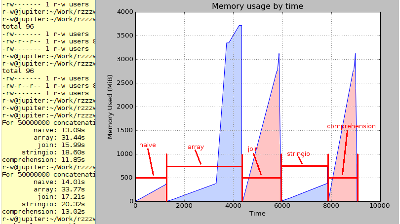

The following tests were conducted some years ago.

More recent results are at
https://github.com/rzzzwilson/Random-Stuff/blob/master/python_speed_tests/string_concat/README.rst.

Methods
=======

If you read the Python programming blogs or google for
"python string concatenation" you find statements that the naive

    'a += b'

method of concatenating strings is horribly slow and uses too much memory.

Well, it's not that simple with newer Pythons. The code here tests various
methods of concatenating strings:

=============  =====================================
Method         Description
=============  =====================================
naive          the old 'a += b' method
array          using the array module .join() method
join           using the list object .join() method
stringio       concatenating with a StringIO object
comprehension  creating a string with comprehension
=============  =====================================

An additional method using mutable strings was tried, but it was so slow it
wasn't tested.

The general method used in **test.py** is a tight loop over a large range
appending a numeric string. The printed results shows that the naive method is
the preferred method: it uses less memory and runs more quickly. This is
contrary to the general sentiment on the web which probably came about because
older Pythons were slow doing 'a += b'.

Using Python 2.7.3 and 50000000 concatenations the times were:

=============  ======
Method         Time
=============  ======
naive          13.02s 
array          31.39s 
join           15.99s 
stringio       19.17s 
comprehension  12.20s 
=============  ======

New Pythons, possibly 2.5 and later, apparently have an optimization for string
objects concatenated in a tight loop. **test.py** tests code of this form.
**test2.py** is a copy of **test.py** with the actual concatenation done in a
small function in an attempt to defeat the above optimization. The naive method
does show the expected pathological behaviour.

A memory profile of test.py is eye-opening! The array, join and
comprehension methods use a lot of memory, much more than expected.

Conclusions
-----------

Generally, if you concatenate a large string in a tight loop use the naive
'a += b' method.

If you need to concatenate string data outside a tight loop, use the .join()
method if you can spare the memory. If you can't, use the stringio method.

If you aren't in a tight loop and you can use the slightly less general
comprehension method then do that if memory is not a concern, else use stringio.

The take-away conclusion: If you are doing a lot of string concatenation work
and you make an assumption about relative speeds, expect this to change with
python updates and codebase changes.  So TEST YOUR ASSUMPTIONS and possibly
build those assumptions into a unittest case.  And test your actual application
speed, possibly in another unittest case.
