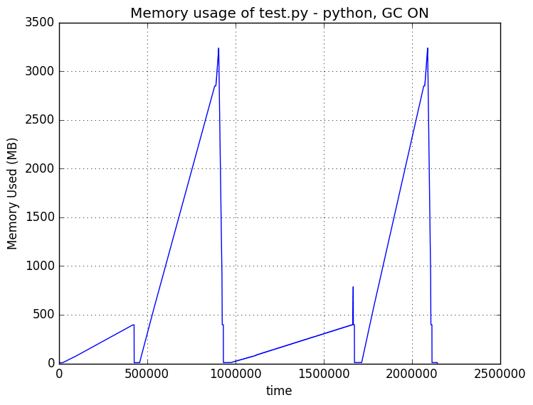
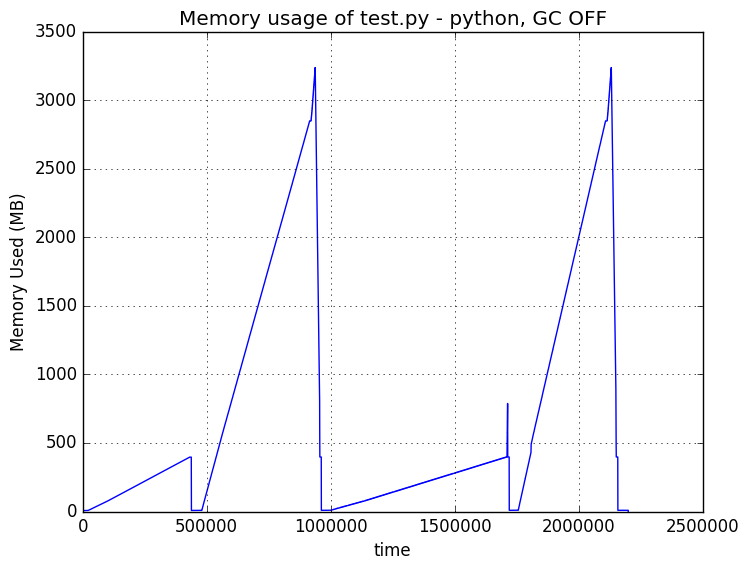
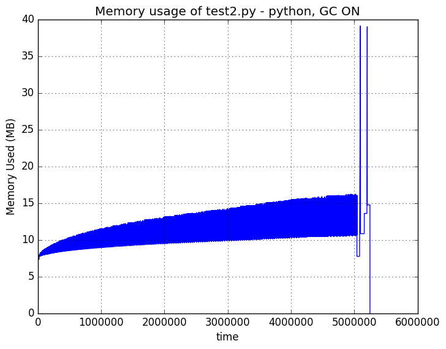
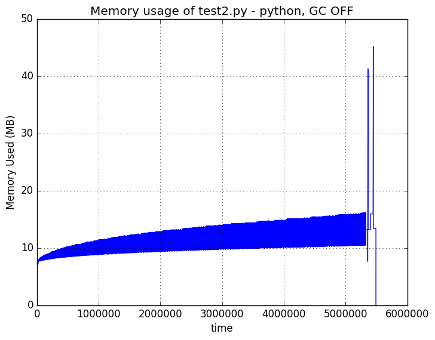
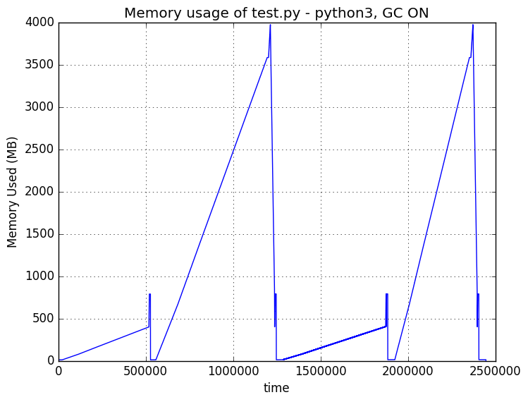
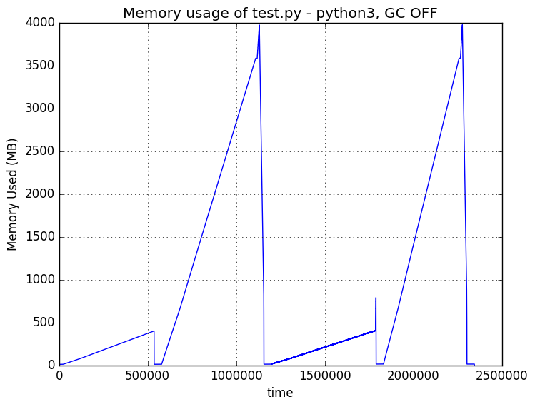
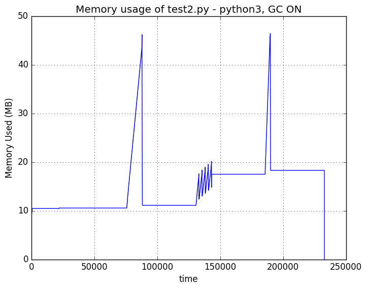

Test Results
============

This shows the time taken for each test and the memory used for both python2 and
python3, with the garbage collector running and disabled.

Each test shows the timings in a table, followed by a graph showing memory
usage during the test.  The graph shows all the tests in the order as shown
in the timing table.  For instance, in the python2/test.py results immediately
below, we see four major peaks representing the usage for the naive, join,
stringio and comprehension methods respectively.

The *test.py* code tests each concatenation method in a direct manner.  Python
does have some optimizations it applies if it can recognize that string
concatenation is occurring.

The *test2.py* code is designed to disable the optimizations python performs on
string contenation.  The timing figures show expected results, but the memory
usage graphs show odd behaviour.  Still working on that!

python running test.py (GC ON)
-------------------------------

| Using Python 2.7.12 on Linux-4.4.0-38-generic-x86_64-with-Ubuntu-16.04-xenial
| For 50000000 concatenations, GC is ON:

+---------------+--------+
| Method        | Time   |
+===============+========+
| naive         |  9.77s |
+---------------+--------+
| join          | 13.54s |
+---------------+--------+
| stringio      | 19.44s |
+---------------+--------+
| comprehension | 11.02s |
+---------------+--------+

python running test.py (GC OFF)
-------------------------------

| Using Python 2.7.12 on Linux-4.4.0-38-generic-x86_64-with-Ubuntu-16.04-xenial
| For 50000000 concatenations, GC is OFF:

+---------------+--------+
| Method        | Time   |
+===============+========+
| naive         |  9.76s |
+---------------+--------+
| join          | 11.48s |
+---------------+--------+
| stringio      | 19.05s |
+---------------+--------+
| comprehension |  9.66s |
+---------------+--------+

python running test2.py (GC ON)
-------------------------------

| Using Python 2.7.12 on Linux-4.4.0-38-generic-x86_64-with-Ubuntu-16.04-xenial
| For 500000 concatenations, GC is ON:

+---------------+--------+
| Method        | Time   |
+===============+========+
| naive         | 34.95s |
+---------------+--------+
| join          |  0.31s |
+---------------+--------+
| stringio      |  0.36s |
+---------------+--------+
| comprehension |  0.09s |
+---------------+--------+

python running test2.py (GC OFF)
-------------------------------

| Using Python 2.7.12 on Linux-4.4.0-38-generic-x86_64-with-Ubuntu-16.04-xenial
| For 500000 concatenations, GC is OFF:

+---------------+--------+
| Method        | Time   |
+===============+========+
| naive         | 36.02s |
+---------------+--------+
| join          |  0.31s |
+---------------+--------+
| stringio      |  0.36s |
+---------------+--------+
| comprehension |  0.09s |
+---------------+--------+

python3 running test.py (GC ON)
-------------------------------

| Using Python 3.5.2 on Linux-4.4.0-38-generic-x86_64-with-Ubuntu-16.04-xenial
| For 50000000 concatenations, GC is ON:

+---------------+--------+
| Method        | Time   |
+===============+========+
| naive         | 13.26s |
+---------------+--------+
| join          | 14.80s |
+---------------+--------+
| stringio      | 16.13s |
+---------------+--------+
| comprehension | 12.33s |
+---------------+--------+

python3 running test.py (GC OFF)
-------------------------------

| Using Python 3.5.2 on Linux-4.4.0-38-generic-x86_64-with-Ubuntu-16.04-xenial
| For 50000000 concatenations, GC is OFF:

+---------------+--------+
| Method        | Time   |
+===============+========+
| naive         | 13.27s |
+---------------+--------+
| join          | 15.82s |
+---------------+--------+
| stringio      | 16.15s |
+---------------+--------+
| comprehension | 12.97s |
+---------------+--------+

python3 running test2.py (GC ON)
-------------------------------

| Using Python 3.5.2 on Linux-4.4.0-38-generic-x86_64-with-Ubuntu-16.04-xenial
| For 500000 concatenations, GC is ON:

+---------------+--------+
| Method        | Time   |
+===============+========+
| naive         |  0.27s |
+---------------+--------+
| join          |  0.29s |
+---------------+--------+
| stringio      |  0.29s |
+---------------+--------+
| comprehension |  0.10s |
+---------------+--------+

python3 running test2.py (GC OFF)
-------------------------------

| Using Python 3.5.2 on Linux-4.4.0-38-generic-x86_64-with-Ubuntu-16.04-xenial
| For 500000 concatenations, GC is OFF:

+---------------+--------+
| Method        | Time   |
+===============+========+
| naive         |  0.27s |
+---------------+--------+
| join          |  0.29s |
+---------------+--------+
| stringio      |  0.30s |
+---------------+--------+
| comprehension |  0.10s |
+---------------+--------+

