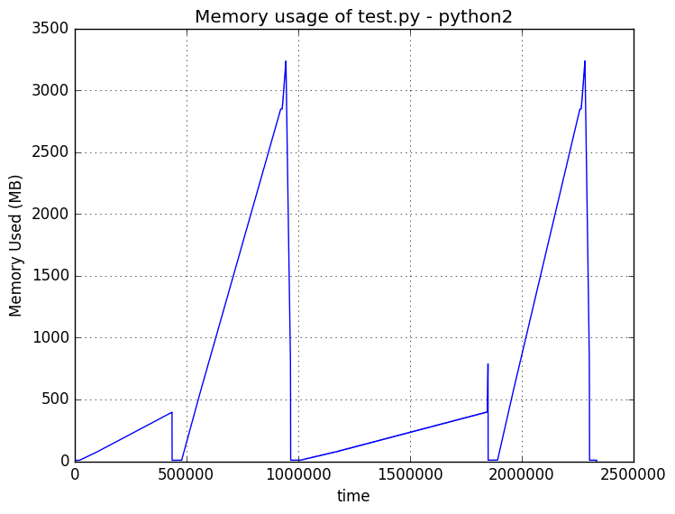
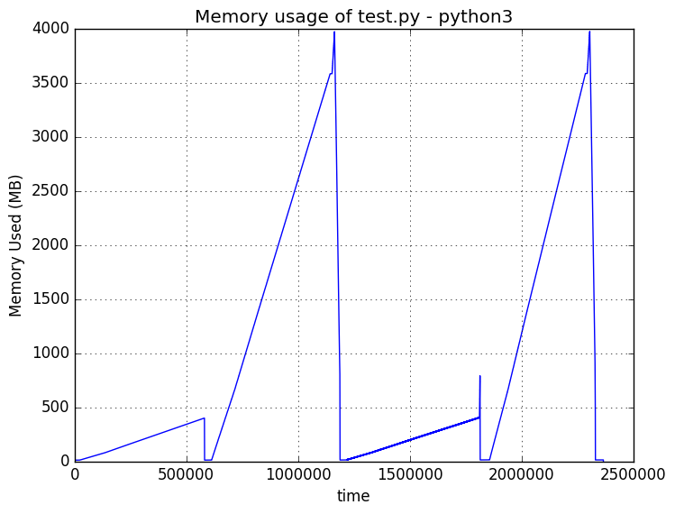
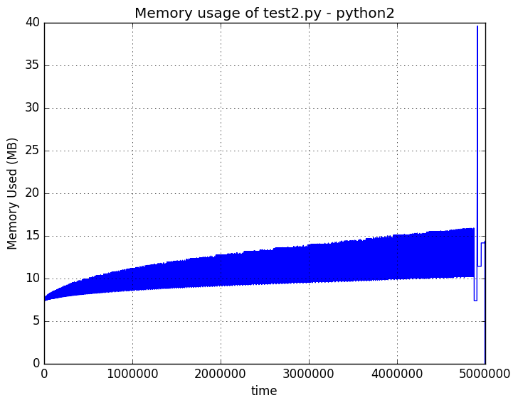
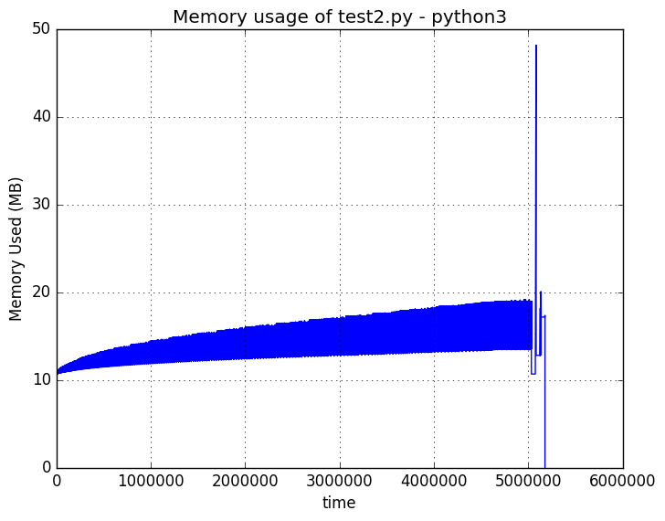

The results file.  Blah. Blah. Blah. Blah. Blah. Blah. Blah. Blah. Blah.
Blah. Blah. Blah. Blah. Blah. Blah. Blah. Blah. Blah. Blah. Blah. Blah. Blah. Blah.
Blah. Blah. Blah. Blah. Blah. Blah. Blah. Blah. Blah. Blah. Blah. Blah. Blah. Blah.
Blah. Blah. Blah. Blah. Blah. Blah. Blah. Blah. Blah. Blah. Blah. Blah. Blah. Blah.
Blah. Blah. Blah. Blah. Blah. Blah. Blah. Blah. Blah. Blah. Blah. Blah. Blah. Blah.
Blah. Blah. Blah. Blah. Blah. Blah. Blah. Blah. Blah. Blah. Blah. Blah. Blah. Blah.
Blah. Blah. Blah. Blah. Blah. Blah. Blah. Blah. Blah. Blah. Blah. Blah. Blah. Blah.
Blah. Blah. Blah. Blah. Blah. Blah. Blah. Blah. Blah. Blah. Blah. Blah. Blah. Blah.

python2 running test.py
=======================

|Using Python 2.7.12 on Linux-4.4.0-38-generic-x86_64-with-Ubuntu-16.04-xenial
|For 50000000 concatenations:

+---------------+--------+
| Method        | Time   |
+===============+========+
| naive         | 10.77s |
+---------------+--------+
| join          | 13.54s |
+---------------+--------+
| stringio      | 21.90s |
+---------------+--------+
| comprehension | 10.37s |
+---------------+--------+

python3 running test.py
=======================

|Using Python 3.5.2 on Linux-4.4.0-38-generic-x86_64-with-Ubuntu-16.04-xenial
|For 50000000 concatenations:

+---------------+--------+
| Method        | Time   |
+===============+========+
| naive         | 14.60s |
+---------------+--------+
| join          | 15.63s |
+---------------+--------+
| stringio      | 15.55s |
+---------------+--------+
| comprehension | 12.15s |
+---------------+--------+

python2 running test2.py
=======================

|Using Python 2.7.12 on Linux-4.4.0-38-generic-x86_64-with-Ubuntu-16.04-xenial
|For 500000 concatenations:

+---------------+--------+
| Method        | Time   |
+===============+========+
| naive         | 139.20s |
+---------------+--------+
| join          | 0.17s |
+---------------+--------+
| stringio      | 0.23s |
+---------------+--------+

python3 running test2.py
=======================

|Using Python 3.5.2 on Linux-4.4.0-38-generic-x86_64-with-Ubuntu-16.04-xenial
|For 500000 concatenations:

+---------------+--------+
| Method        | Time   |
+===============+========+
| naive         | 139.71s |
+---------------+--------+
| join          | 0.19s |
+---------------+--------+
| stringio      | 0.20s |
+---------------+--------+

