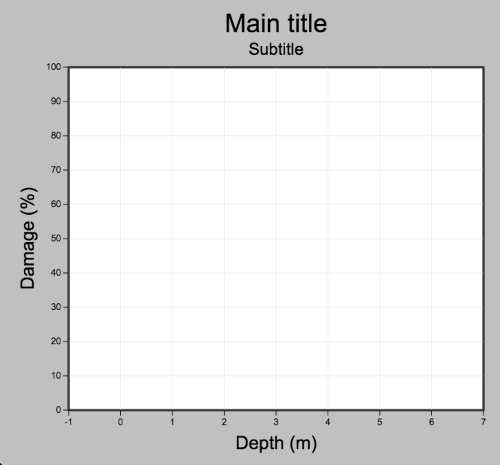

webEloss API
============

This is the design document for the API to use the webELoss widget.

The widget is designed to fit into any web page you want.  Once the 
widget code is running the user will interact with it

Instantiation
-------------

To get an instance of a webELoss widget in your web page, you need
to:

* create a 
 that will contain the widget
* instantiate the widget

The 
 you create to contain the widget doesn't have to be empty,
but if it isn't you run the risk of the widget code fiddling with your
objects within the 
.

A simple example that doesn't do anything:

::

    <!DOCTYPE html>
    <html xml:lang="en" lang="en">
        <head>
            <link rel="stylesheet" type="text/css" href="webeloss.css">
            
            
        </head>
        <body onload="run_js();">
            

        </body>
    </html>

Note that you need to link to the widget javascript and CSS files.

Configuration
-------------

There are many methods that the user may use to change the widget configuration.
Before we talk about them we need to define names for various parts of the
widget display.

